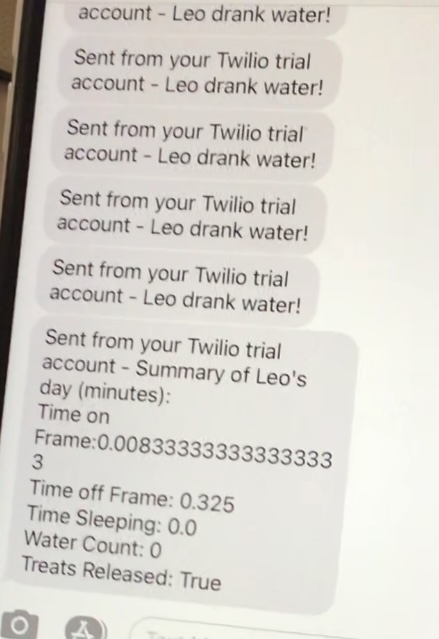

# Pet Monitor and Mini Treat Dispenser 

### Video Demo: 
### Report and Tutorial:

This is the repo for a pet monitor using a Raspberry Pi. This project was also the final project of the course Internet of Things (CS-437) at the University of Illinois Urbana-Champaign as part of the Masters in Computer Science program. 

The pet monitor provides the capability to monitor where a pet spends time in specific locations. For my case, I wanted to see how much of the time my dog spent sleeping and how many times he went to his water bowl. In addition, based on the elapsed time, a servo based dispesner also releases treats. For each activity, the code also sents a text message to my phone. A summary text at the end of the day is also sent containing what he has done. 

The report in the repo goes through the entirety of the code as well as what dependencies are needed to run the file provided. The code is written in python and uses TensorFlow Lite. Twilio is used to create SMS notifications. The video link provided also goes through a demo. 

Changes can be made to the code for personal use. The Twilio credentials will need to be updated as will the coordinates of locations that want to be monitored. Additional functionality can be added such as live video monitoring and live interaction with the servo from application development. Would be happy to hear about potential developments!

<figure>

<figcaption align = "center"><b>Dog Classification</b></figcaption>
</figure>

<figure>

<figcaption align = "center"><b>Dog Classification</b></figcaption>
</figure>

<figure>

<figcaption align = "center"><b>Dog Classification</b></figcaption>
</figure>
